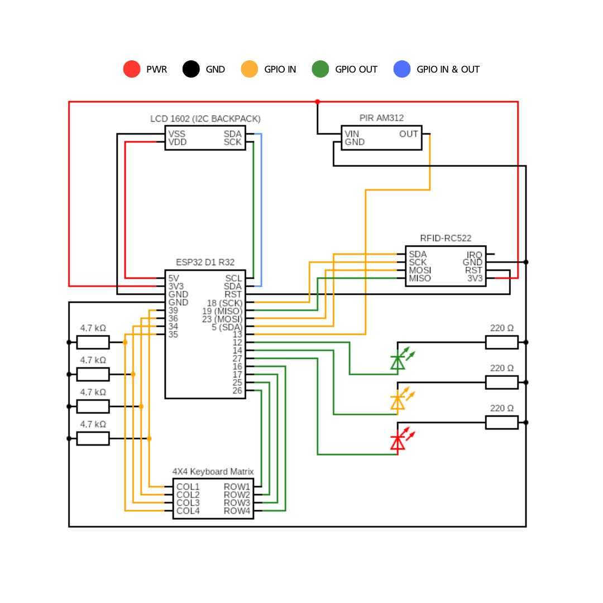

# SoteriaSystems (ESP32 Alarm System)
This is a lightweight DIY home alarm system, communicating with a server to simulate the logic of checking credentials against a database.
This is a part of a larger system containing a server, database and frontend made together with:
* https://github.com/VictorErikson
* https://github.com/falafelsallad

For the whole project, please visit: https://github.com/lafftale1999/summerCodeAlarmSystem

## Overview
This projects implements a light weight home alarm system using an ESP32. It supports both PIN- and RFID-based arming/disarming with hashed values, motion detection, LED/LCD feedback and HTTP POST request over WIFI.

## Features
* PIN entry via a 4x4 keypad
* RFID scan of tag via RFID-RC522 scanner
* Motion sensitivity via PIR AM312
* Status display on 16X2 I2C LCD
* Status feedback via green, yellow and red LEDs
* Wi-Fi connectivity with reconnection logic
* HTTP POST request with status code statement

## Hardware
These are the components used in my solution:
* ESP32 D1 R32 dev board
* 4x4 keyboard matrix
* LCD 16X2 with I2C backpack
* RFID scanner RFID-RC522
* PIR AM312 sensor
* Green, Yellow and Red LEDs

### Schematic


## Configurations
These are the following configurations you will need to get the project running:

### components/project_config/include/gpio_config.h
Switch the following to match which GPIOs you are using for your project.
```c
#define KEYPAD_ROW_PINS {GPIO_NUM_26, GPIO_NUM_25, GPIO_NUM_17, GPIO_NUM_16}
#define KEYPAD_COL_PINS {GPIO_NUM_39, GPIO_NUM_36, GPIO_NUM_34, GPIO_NUM_35}

#define GREEN_LED_PIN                   GPIO_NUM_27
#define ORANGE_LED_PIN                  GPIO_NUM_14
#define RED_LED_PIN                     GPIO_NUM_12

#define AM312_SENSOR_PIN                GPIO_NUM_13
```

### components/project_config/include/i2c_config.h
Switch the following to match your I2C setting.
```c
#define I2C_MASTER_SCL_IO           GPIO_NUM_22                  /*!< GPIO number used for I2C master clock */
#define I2C_MASTER_SDA_IO           GPIO_NUM_21                  /*!< GPIO number used for I2C master data  */
#define I2C_MASTER_NUM              I2C_NUM_0                   /*!< I2C port number for master dev */
#define I2C_MASTER_FREQ_HZ          100000                      /*!< I2C master clock frequency */
#define I2C_MASTER_TX_BUF_DISABLE   0                           /*!< I2C master doesn't need buffer */
#define I2C_MASTER_RX_BUF_DISABLE   0                           /*!< I2C master doesn't need buffer */
#define I2C_MASTER_TIMEOUT_MS       1000
#define I2C_DEVICE_ADDRESS_LEN      I2C_ADDR_BIT_LEN_7
```

### Create a "credentials.h" in main/include
In a Linux environment use the following command:

```sh
cd main/include/
touch credentials.h
```

Define the following in the `credentials.h`:
```c
#ifndef SOTERIA_CREDENTIALS_H_
#define SOTERIA_CREDENTIALS_H_

#define WIFI_SSID               "my_network"
#define WIFI_PASS               "admin123"

#define DEVICE_ID               "device123"

#define API_URL                 "https://192.168.0.104:8080"
#define API_CHECK_IN            "check_in"
#define API_CHECK_AUTH          "auth"
#define API_ALARM_TRIGGERED     "alarm_triggered"
#define API_NEW_USER            "new_user"

#endif
```

## Dependencies
### ESP-IDF
Espressif IoT Developer Framework version 5.4.1 or later https://docs.espressif.com/projects/esp-idf/en/stable/esp32/get-started/index.html

### Submodules
Make sure that all submodules are downloaded:

#### If you already downloaded the project:
```bash
git submodule update --init --recursive
```

#### If you haven't downloaded the project:
```bash
git clone --recurse-submodules https://github.com/lafftale1999/SoteriaSystems.git
```

#### To check if you need to update the submodules:
```bash
git submodule status
```

## Build Process
1. Download the whole project including submodules: 
    ```bash
    git clone --recurse-submodules https://github.com/lafftale1999/SoteriaSystems.git
    ``` 
1. Open the ESP-IDF terminal and navigate to the root folder `../SoteriaSystems/`
1. Run the command
    ```sh
    idf.py build
    ``` 
1. Run the command
    ```sh
    idf.py -p COM3 flash
    ```
1. Run the command
    ```sh
    idf.py -p COM3 monitor
    ```
1. Check console for logging messages.

## Words about the project
This has been an amazing project for learning more about callback functions, opaque pointers to encapsulated and heap allocated data structures. I've also spent a lot of time working out how to handle the separate events by defining an event type and app_handle that are placed in a FreeRTOS queue that the main task consumes.

We did not manage to get HTTPS working due to serverside problems, but this function should of course be implemented before even considering this system remotely safe. This was mainly build to make a more advanced solution, in collaboration with people working with other parts of the project and then integrating it.

Thank you for looking through it and please reach out to me if you have any questions!